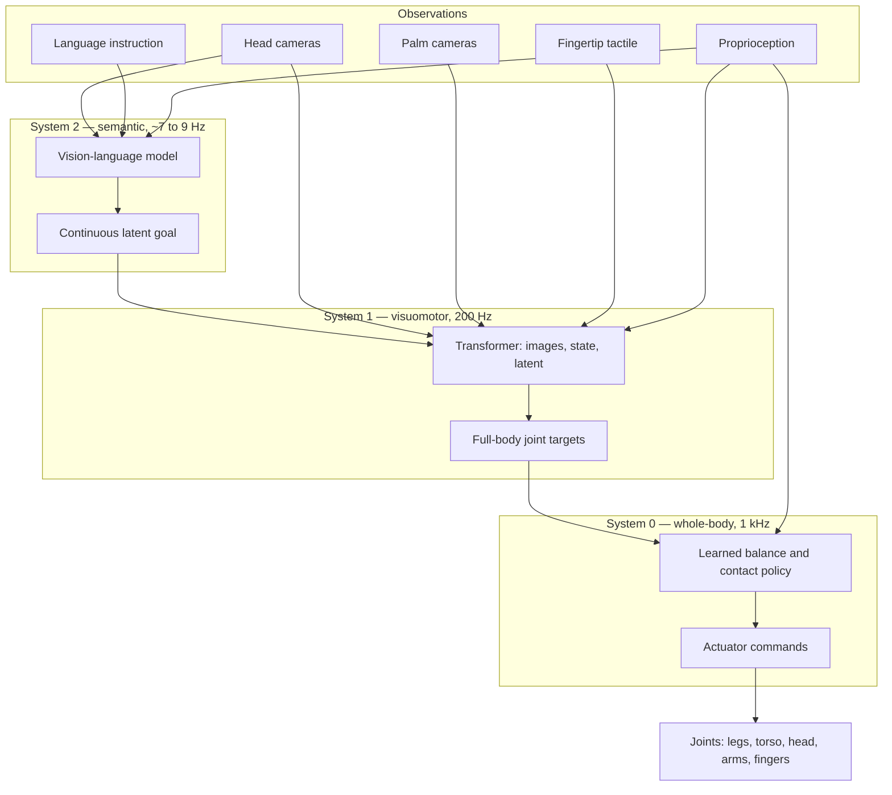

# Zero-Shot Whole-Body Autonomy in Unseen Homes: A Technical Review of Figure Helix 2.5

**A narrative review of public disclosures. No original experiments.**

18 September 2026

> This manuscript reconstructs Figure AI's Helix lineage and the 17 September 2026 Helix 2.5 announcement from company technical posts and contemporaneous reporting. Quantitative results are reproduced from those sources and were not independently replicated. Architectural details that Figure has not published are marked as such. Related: [[entities/openral]] dual-system S0/S1/S2; sources [[sources/figure-helix-lineage]].

---

## Abstract

General-purpose humanoids are not limited by a shortage of scripted skills so much as by the cost of teaching each skill in each place the robot will work. On 17 September 2026, Figure AI reported that Helix 2.5, a whole-body vision-language-action policy pretrained on Index, the company's large-scale human-behavior dataset, performed three long-horizon household behaviors across thirty previously unseen Bay Area homes without collecting data, fine-tuning, or adapting weights in those environments. Holding task-specification data, architecture, and evaluation fixed, Index pretraining raised complete-task success from 9% to 56%. The same pretrained base was adapted into tidying, towel folding, and bed making, then frozen for evaluation. This review reconstructs the Helix stack from public posts: a slow vision-language layer that compresses scene and instruction into a latent (System 2), a 200 Hz visuomotor transformer that emits full-body joint targets (System 1), and a 1 kHz learned whole-body controller for balance and contact (System 0). Environment "understanding" in this stack is not an explicit map. It is a learned, closed-loop mapping from pixels, touch, proprioception, and language to the next action, made transferable by pretraining on diverse human video and specified by a comparatively small robot dataset collected elsewhere. We place Helix 2.5 against RT-2, OpenVLA, $\pi_0$, and GR00T N1; distinguish environment-and-object zero-shot from skill zero-shot; and argue that the result is best read as a data-scaling claim about human-to-humanoid transfer, not as evidence of reliable household autonomy. The evaluation is company-run, the Helix 2.5 architecture is under-specified relative to the 2025 Helix write-up, and a measured action-prediction scaling law is not yet a scaling law for physical success.

**Keywords:** vision-language-action models, humanoid robots, zero-shot generalization, human-to-robot transfer, dual-system control

---

## 1. Introduction

A person who has made one bed can make another. The mattress height changes, the comforter bunches differently, and the room is unfamiliar, but the work transfers. Contemporary robot learning mostly does not. Policies are expensive to specify and, once specified, tend to be expensive to move. Imitation-learning skills grow with demonstrations collected where the robot will operate. Classical programs grow with expert time spent on that same site. Both strategies treat a new house as a new problem.

Vision-language-action (VLA) models were proposed to change that scaling curve. Internet-pretrained vision-language models already classify objects, follow instructions, and absorb some common sense about what a "pillow" or a "basket" is. If that semantic knowledge can be turned into continuous motor commands, a robot might generalize to objects and layouts it has not been shown, rather than requiring a new demonstration set for every kitchen. Early VLAs demonstrated language-conditioned manipulation and object generalization on tabletop and mobile-manipulator platforms [6], [7], [8], [9]. Humanoid whole-body control in real homes remained a harder instance of the same idea, because locomotion, reach, gaze, and grasp are coupled: the robot must walk to see, shift stance to reach, and recover when a fold fails, all in geometry that was not designed around a robot base.

Figure's Helix, announced in February 2025, was a dual-system VLA for high-rate upper-body humanoid control [2]. Helix 02, in January 2026, extended that control to the full body by adding a learned 1 kHz whole-body layer and connecting palm cameras and fingertip tactile sensing [3]. Those systems still learned from data collected in the environments where they were evaluated. Helix 2.5, announced on 17 September 2026, asks a different question: can a humanoid enter a home it has never seen and immediately perform long-horizon whole-body work with a frozen checkpoint [1]? Figure's answer is a qualified yes. A foundation model pretrained on Index, a global human-behavior video dataset [4], was adapted into three behaviors and evaluated in thirty unseen homes. Index pretraining, not the task data alone, accounted for most of the reported zero-shot success [1].

This review has four aims. First, it reconstructs the public Helix architecture and data pipeline so that "environment understanding" can be discussed as an engineering object rather than a slogan. Second, it reports Helix 2.5's evaluation protocol and numbers as Figure stated them, including the ablation that isolates Index. Third, it locates the result in the VLA literature, with emphasis on what "zero-shot" does and does not mean. Fourth, it lists the claims that cannot be checked from public materials. No weights, datasets, or independent rollouts are available. The contribution is synthesis and critique, not a new experiment.

---

## 2. Related work

### 2.1 Vision-language-action models

RT-1 showed that a transformer policy trained on a large multi-task demonstration corpus could follow language and generalize moderately across objects and environments on a mobile manipulator [6]. RT-2 co-fine-tuned a vision-language model on robot actions represented as tokens, transferring web-scale semantic knowledge into control and improving generalization to novel objects and instructions [7]. OpenVLA made a 7B-parameter open VLA trained on approximately 970,000 Open X-Embodiment demonstrations, combining SigLIP and DINOv2 visual features with a Llama 2 backbone and discrete action tokens [8], [11]. Physical Intelligence's $\pi_0$ instead uses a flow-matching action expert on a pretrained VLM, targeting high-frequency continuous control and cross-embodiment training rather than tokenized low-dimensional grippers [9]. NVIDIA GR00T N1 is an open humanoid foundation model with an explicit dual-system split: a vision-language module interprets scenes and instructions, and a diffusion transformer produces motor actions; training mixes robot trajectories, human video, and synthetic data [10].

Two architectural tensions run through this literature. The first is rate versus generalization. Billion-parameter VLMs are too slow to close a dexterous control loop, while small visuomotor policies are fast but semantically brittle. Dual-system designs, including Helix, $\pi_0$, and GR00T N1, assign scene and language understanding to a slower backbone and high-rate actions to a smaller expert that cross-attends to, or is conditioned on, the backbone's representation. The second tension is data source. Robot teleoperation is on-distribution for control but expensive. Human video is abundant and diverse but off-embodiment. Several 2025--2026 efforts, including GR00T N1, Figure's Project Go-Big [5], and robotization pipelines such as HuRo [17], treat that gap as the central research problem rather than a nuisance.

### 2.2 Imitation learning and high-rate control

Before VLAs, high-dimensional manipulation increasingly used action chunking and generative action heads. Action Chunking with Transformers (ACT) predicts short action sequences to reduce compounding error [12]. Diffusion Policy treats action generation as conditional denoising, which is expressive for multimodal demonstrations [13]. Helix's original write-up is explicit that it does not use diffusion or action tokenization: it regresses continuous upper-body targets from pixels and text [2]. Helix 02 does not restate the training loss, so later Helix variants should not be assumed to remain pure regression [3]. The relevant comparison is not the generative family but the output: Helix-class models emit high-dimensional continuous humanoid commands at 200 Hz rather than discrete tokens at a few hertz.

### 2.3 Human video and scaling

Language-model scaling laws showed that next-token loss improves predictably with data and compute [14]. Robotics has lacked an analogous public result for human-to-robot transfer on a humanoid. Project Go-Big reported that Helix could map egocentric human video to navigation commands with no robot demonstrations [5]. Index industrializes that thesis as a consumer-app collection network [4]. Helix 2.5 then reports that doubling Index pretraining data reduces held-out robot action-prediction loss smoothly enough to forecast a larger run before it is trained [1]. That is a training-loss scaling claim. It is not yet a demonstration that physical task success will follow the same curve.

---

## 3. Scope and sources of this review

This is a narrative technical review, not a systematic review and not a reproduction study. Primary sources are Figure's technical blog posts for Helix [2], Helix 02 [3], Project Go-Big [5], Index [4], and Helix 2.5 [1]. Secondary reporting was used only to cross-check numbers that also appear in the primary posts. Academic citations provide context; they are not a claim that Figure trained against those baselines.

We treat company numbers as reported measurements, not as independently verified facts. We do not infer unpublished architecture: Helix 2.5's parameter counts, latent dimension, loss, and whether System 0 changed are not stated in the 2.5 post. Where the 2025 Helix paper-equivalent is the only detailed architecture, we say so. "Zero-shot" is used only in Figure's sense, defined in Section 7.

---

## 4. The Helix lineage

Helix is a product line of onboard VLAs for Figure humanoids, not a single frozen architecture. Table 1 summarizes what each public release actually demonstrated.

**Table 1.** Public Helix releases reconstructed from Figure posts [1]--[5]. Entries marked "?" are not stated in the cited source.

| Release | Date | Control scope | Distinctive claim | Pretraining | Evaluation setting |
|---|---|---|---|---|---|
| Helix | 20 Feb 2025 | Upper body, 35 DoF, 200 Hz | Single-weight VLA; language pick-up of novel objects; two-robot grocery collaboration | Internet VLM + ~500 h robot teleop | In-distribution homes/lab; held-out objects |
| Project Go-Big | 18 Sep 2025 | Navigation added to the same network | Human-video-only transfer to speech-to-nav | Egocentric human video, including Brookfield homes | Cluttered real homes for navigation |
| Helix 02 | 27 Jan 2026 | Full body; S0 at 1 kHz | Room-scale loco-manipulation; palm cameras and tactile; 4 min dishwasher, 61 actions | Pretrained VLM start; robot data where it operates | Familiar kitchens and factory pieces |
| Index | 25 Aug 2026 | Data system | App-scale human behavior corpus | Creators worldwide | Not a policy release |
| Helix 2.5 | 17 Sep 2026 | Full-body behaviors | Frozen policy in 30 unseen homes; Index ablation 9% → 56% | From-scratch pretrain on Index, then robot task data from other sites | 30 Bay Area homes; unseen objects |

The original Helix result that still matters for 2.5 is the communication protocol, not the grocery video. A 7B open-weight VLM (System 2) running at 7--9 Hz consumes a monocular robot image, wrist pose, finger state, and a natural-language command, and writes a single continuous latent. An 80M cross-attention encoder-decoder transformer (System 1) reads that latent plus higher-rate images from a convolutional vision backbone pretrained in simulation, and outputs wrist poses, finger flexion and abduction, and torso and head orientation at 200 Hz, plus a synthetic percent-complete signal used to terminate and chain behaviors [2]. Training is end-to-end regression from pixels and text to actions. Gradients flow from System 1 into System 2 through the latent, so the semantic vector is optimized for control rather than for captions. A train-time temporal offset between the two systems is matched to onboard latency. At deployment, System 2 and System 1 run on separate embedded GPUs; System 2 asynchronously updates a shared-memory latent while System 1 holds the 200 Hz loop [2].

Helix 02 adds the missing motor substrate. System 0 is described as a 10-million-parameter network that takes full-body joint state and base motion and emits actuator commands at 1 kHz. It is trained in simulation on more than 1,000 hours of joint-level retargeted human motion across more than 200,000 parallel environments with domain randomization, and is presented as replacing on the order of 110,000 lines of hand-engineered C++ [3]. System 1 grows from upper-body control to all sensors in and all joints out: head cameras, palm cameras, fingertip tactile sensors claimed to resolve forces as small as three grams, and full-body proprioception, covering legs, torso, head, arms, wrists, and fingers. System 2 still produces semantic latents, now over room-scale language such as walking to a dishwasher, carrying bowls, and returning to a rack [3]. The headline demonstration is a continuous four-minute dishwasher unload and reload with 61 ordered loco-manipulation actions, including using a hip to close a drawer and a foot to lift a door when the hands are occupied.

Helix 2.5 does not republish this stack. It does say two things that change how the stack should be trained. First, Helix 02 still learned from data collected where the robots would operate, whereas 2.5 is evaluated with zero data from the test homes [1]. Second, Helix 2.5 is pretrained from random initialization entirely on Index, unlike Helix 02, which started from a pretrained vision-language model [1]. The inference hierarchy in Figure 1 is therefore Helix 02's, carried forward as the only published whole-body control diagram, not a confirmed 2.5 schematic.

**Figure 1.** Helix 02 runtime hierarchy as published [3], with System 2 details from the 2025 Helix post [2]. Helix 2.5 does not confirm parameter counts or that this diagram is unchanged.

---

## 5. Data and training

### 5.1 From teleoperation labels to a human-video flywheel

Original Helix was trained on approximately 500 hours of multi-robot, multi-operator teleoperation. Language was not written by operators at collect time. A VLM auto-labeled segmented onboard clips with the hindsight prompt "What instruction would you have given the robot to get the action seen in this video?" Items seen in training were excluded from evaluation [2]. That recipe can teach a single set of weights to pick unseen objects by name, operate drawers, and coordinate two robots, but it still spends robot time in the places the policy will work.

Project Go-Big stated the alternative: a humanoid's cameras and kinematics are close enough to a person's that egocentric human video can be a pretraining corpus. Figure reported speech-to-nav in cluttered homes from a model trained on 100% human video and no robot demonstrations, with one network outputting both manipulation and SE(2) navigation [5]. Index, launched publicly on 25 August 2026 after four months in stealth, is the attempt to industrialize that corpus [4]. Figure reports 264,000 app downloads across 108 countries, more than 44,000 weekly active creators, more than 16 million uploaded videos, and an ingest rate of about 30 minutes of video per second (the Helix 2.5 post says roughly 35 minutes of new human experience per second). Creators had been paid $15 million at Index launch. Per 1,000 hours, Index is said to contain 373 unique tasks, 1,146 unique manipulated objects, and 116 unique environments [4]. Figure has committed to spend more than $1 billion on data and compute over the following twelve months and $3.5 billion of compute on Helix [1], [4].

**Figure 2.** Training and evaluation pipeline reconstructed from Index [4] and Helix 2.5 [1].

Ingesting consumer video at that rate required a five-stage pipeline: automated filters for technical, visual, and semantic quality; human fraud review at user level; embedding-based deduplication; rebalancing by task quotas and embedding clusters; and hierarchical text captions on every accepted episode [4]. Helix 2.5 additionally characterizes Index by clustering video embeddings of every clip and text embeddings of a VLM's per-segment activity and object descriptions, then measuring how hours distribute over those groups. No evaluation task is more than 1.90% of the pretraining set [1]. That number is the company's answer to the obvious contamination worry: that "zero-shot tidying" is just Index containing a lot of tidying.

What Index does not disclose is the robotization step. Human video does not contain Figure 03 joint targets, tactile traces, or palm-camera images. HuRo and related work argue that converting human video into robot-aligned observations and action trajectories outperforms visual-only pretraining [17]. Figure reports that Index pretraining improves downstream next-robot-action prediction [1], which implies some action-side transfer objective, but the retargeting, latent-action, or inverse-dynamics method is not published.

### 5.2 Helix 2.5 training recipe

The stated recipe is "learn broadly in pretraining, specify a behavior once, and generalize at deployment" [1]. Concretely, Helix 2.5 is pretrained from random weights on Index. One foundation model is then adapted into three whole-body behaviors: tidying living rooms, folding towels, and making beds. Adaptation uses robot task-specification data that excludes evaluation homes and evaluation objects. Each behavior uses a single frozen checkpoint across all thirty homes. No evaluation rollout is used for checkpoint selection [1].

An important comparison is data efficiency versus Helix 02. Figure trained a Helix 02 policy on the same task with data collected in the environment where it was evaluated. Helix 2.5 matched that success rate with half as much adaptation data, then ran zero-shot across thirty homes rather than in the collection site [1]. If the comparison holds, pretraining buys both cheaper specification and wider deployment scope.

---

## 6. Reported Helix 2.5 results

### 6.1 Evaluation protocol

Figure rented thirty Bay Area homes that contributed no training data. Evaluation objects---toys, towels, bedding---were set aside before experiments. An AI model plus human review checked that they did not appear in task-specification data. The robot used each home's existing couches, beds, and folding surfaces. "Zero-shot" in this protocol refers to evaluation environments and manipulated objects. The three behaviors were specified by fine-tuning data collected elsewhere [1].

Success is complete-task, with no partial credit. Living-room tidy requires all 13--15 scattered toys in the basket. Towel folding requires every towel folded and in the basket. Bed making requires both pillows and comforter corners at the top of the bed with the comforter pulled smooth. Timeouts abort a trial (one minute per toy, three minutes per towel, one minute per pillow and per comforter side). A human safety intervention fails the trial. Initial configurations are unique per trial, with objects placed arbitrarily [1]. Each task used 140 trials (30 homes × the per-home trial structure Figure reports), for 420 trials in the combined Index-pretrained evaluation.

### 6.2 Index ablation

The central experiment holds task-specification data, architecture, optimization, hyperparameters, and evaluation fixed, and varies only initialization. One policy starts from random weights. The other starts from the Index-pretrained Helix 2.5 model. The from-scratch policy succeeded on 9% of zero-shot trials. The Index-pretrained policy succeeded on 56%, described as more than 6× higher [1]. Because pretraining is the only experimental variable in this comparison, Figure attributes most of Helix 2.5's zero-shot capability to Index rather than to the three task datasets.

Secondary reporting of the same evaluation gives per-task counts for the Index-pretrained policies: bed making 94/140 (67%), towel folding 87/140 (62%), tidying toys 56/140 (40%), combined 237/420 (56%) [15], [16]. These counts are consistent with the 56% headline. Tidying, which requires searching a cluttered room, locomoting to many objects, and terminating only when every item is contained, is the weakest of the three.

**Table 2.** Helix 2.5 complete-task success as reported. The 9% versus 56% comparison is from Figure's controlled ablation [1]. Per-task counts are from contemporaneous summaries of the same evaluation [15], [16].

| Condition | Task | Success |
|---|---|---|
| From scratch, identical task data | Combined | 9% |
| Index-pretrained Helix 2.5 | Combined | 56% (237/420) |
| Index-pretrained | Bed making | 67% (94/140) |
| Index-pretrained | Towel folding | 62% (87/140) |
| Index-pretrained | Living-room tidy | 40% (56/140) |

### 6.3 Qualitative behavior and a transfer scaling law

Figure emphasizes whole-body self-correction as a qualitative effect of Index: stepping back, changing stance, walking around a bed to repair a fold, and continuing rather than stalling [1]. That is the practical content of long-horizon competence in a new house. A policy that cannot recover will fail any complete-task rubric as soon as the first grasp slips.

Separately, four models were trained on nested Index subsets spanning an 8× increase in pretraining data, with model size and downstream training held fixed, then fine-tuned on the same task data and scored on held-out action-prediction loss. Loss fell with each doubling. Using only the smaller runs, Figure reports forecasting the largest run's test loss to four decimal places, with forecasting error equal to 0.54% of the loss variation across the 8× range [1]. The company calls this the first human-to-humanoid robot transfer scaling law measured on a humanoid. It measures data scaling of a proxy loss, not of 30-home success.

---

## 7. What "understanding the environment" means in this stack

It is easy to hear Helix 2.5 as a claim that the robot builds a house model, inventories furniture, and then plans. Nothing in the public stack says that. There is no published SLAM map, scene graph, object-permanence database, or counterfactual world model. Helix is an action generator. Environment understanding, as implemented, is the learned ability to emit the next whole-body command that makes progress on a language-specified behavior from the current image, tactile reading, and proprioception, in a house whose layout was not in the robot fine-tuning set.

Three mechanisms make that possible, and they should be kept distinct.

Semantic priors live in System 2. An internet-pretrained VLM, in the 2025 design, already binds words to visual categories. After control-oriented fine-tuning, the same backbone can map "pick up the desert item" onto a toy cactus and a grasp [2], or, in Helix 02, expand a dishwasher instruction into a sequence of latent goals without specifying footsteps [3]. This is category-level scene understanding: what kind of thing is in view, and what subgoal is active. Helix 2.5's from-scratch Index pretraining complicates the story. If System 2 is no longer initialized from a web VLM, then object semantics must be acquired from Index captions and video rather than from internet pretraining. Figure does not describe the 2.5 backbone, so it is not known whether web semantics were abandoned or reintroduced during adaptation.

Sensorimotor coupling lives in System 1 and the Figure 03 hardware. Head cameras provide a human-like egocentric view. Palm cameras supply in-hand vision when the head is occluded. Fingertip tactile sensing supplies contact that vision cannot. Because head and torso are action dimensions, looking is something the policy does. Active perception is not a separate mapping module. In a new living room, "understanding" includes walking until a toy is visible and leaning until a comforter corner is reachable [1]. System 0 then keeps those motions physically legal. Without a learned balance prior, a VLA that outputs whole-body targets in an unseen floorplan would be limited by scripted locomotion handoffs of the kind Helix 02 was written to retire [3].

Distributional coverage lives in Index. A new house is zero-shot only relative to robot fine-tuning. Relative to pretraining, it is hoped to be in-distribution: another cluttered room, another bed height, another lighting condition, another way a human would recover from a bad fold. The 9% versus 56% ablation is the evidence that this coverage is doing causal work, not merely correlating with a bigger training run. The 1.90% task-share figure is the evidence that the coverage is broad rather than a near-duplicate of the eval chores. Neither figure is a substitute for an independent contamination audit.

Zero-shot, in Figure's usage, therefore does not mean that an untrained robot arrived and invented chores. It means that for three behaviors specified elsewhere, homes and objects can change without touching weights. That is environment generalization, which is a real and previously scarce result on whole-body humanoids. It is not open-ended household intelligence.

---

## 8. Discussion

### 8.1 What Helix 2.5 changes

If the ablation is taken at face value, the field should update two priors. The first is that site-specific robot data is the dominant way to get long-horizon humanoid chores. Helix 02 already showed multi-minute loco-manipulation, but in places the robots had been taught. Helix 2.5 moves the expensive resource from "hours in this house" toward "hours of human experience anywhere," then spends a smaller robot budget to name the behavior. The second prior is that web-VLM initialization is the main source of object generalization. Helix 2.5's from-scratch Index pretrain outperforming an identical from-scratch policy trained only on task data suggests that embodied human video can supply the transferable representation, at least for these three chores.

The comparison with other VLAs should be drawn carefully. RT-2 and OpenVLA generalize over objects and instructions on manipulator platforms, typically with discrete or low-dimensional actions and without bipedal whole-body coupling [7], [8]. $\pi_0$ emphasizes cross-embodiment flow matching and high-rate continuous control, still largely in manipulation settings [9]. GR00T N1 is the closest public dual-system humanoid analogue, including human-video mixture training [10], but it does not report a 30-home frozen-checkpoint household eval of this form. Helix 2.5's distinctive claim is not "a VLA exists." It is that whole-body, long-horizon, complete-task success can transfer across thirty real residences with no on-site data.

### 8.2 What the numbers do not say

Fifty-six percent complete-task success is a research milestone and a service-quality failure. Nearly half of trials do not finish under a rubric that already allows minutes per object and ignores interruptions, occupied rooms, multi-day repetition, and any chore outside the three. Tidying at 40% is the number that should discipline deployment talk: search-and-stow in clutter is closer to actual housework than folding towels onto a known basket.

The evaluation is company-run and company-graded. Blindness is described for the from-scratch versus Index comparison and for checkpoint selection, which is better than a highlight reel, but graders, home selection, and trial resets remain internal. There is no public baseline from another lab's VLA on the same thirty homes, and there cannot be, because Index, the robots, and the protocol are proprietary.

The scaling law is a proxy-loss law. Language models could lean on a loss that later tracked downstream benchmarks. Robot action-prediction loss may or may not track complete-task success once recovery, timeouts, and safety aborts dominate. Figure does not plot 30-home success against Index hours, only held-out loss against Index hours. Until that second plot exists, "it is time to scale up" [1] is a bet, not a measured production function for household reliability.

Finally, architecture opacity increased just as claims increased. The 2025 Helix post is the most detailed methods document Figure has released. Helix 2.5, which is described as the most advanced network Figure has built, does not say whether System 2 is still a 7B VLM, whether the loss is still regression, whether S0 is unchanged, or how Index video becomes robot-action supervision. A review can reconstruct a pipeline. It cannot audit one.

### 8.3 Implications for dual-system robot stacks

OpenRAL's harness uses the same timescale split in a different way: S1 as a fast skill, S2 as a typed reasoner, S0 as a high-rate cerebellar layer in `ros2_control` for humanoids (from [[entities/openral]]). Helix 2.5 is evidence that the split is empirically productive when the slow layer's latent is trained end-to-end for control and when the fast layer sees the whole body as one plant. It is also evidence that generalization may come more from pretraining distribution than from a more elaborate world-state schema. That is a tension worth naming. Explicit world state remains the right contract for safety, replay, and tool-calling. Implicit latents currently appear to be the right substrate for "this unfamiliar comforter still needs to be pulled." Hybrid stacks will have to keep both, rather than assuming that a better map will replace a better prior, or the reverse.

---

## 9. Limitations of this review

This manuscript inherits every limitation of its sources. It cannot inspect code, weights, Index clips, or raw trial logs. Secondary per-task counts are consistent with Figure's combined 56% but are not a substitute for a table in the primary post. Related-work placement uses published VLA papers as context and does not imply that Figure compared against them. No PRISMA search was performed; this is not a systematic review of humanoid VLAs. Interpretive sections (especially Section 7) distinguish reconstruction from speculation, but reconstruction of an unpublished 2.5 backbone remains speculation and is labeled as such.

---

## 10. Conclusion

Helix 2.5 is the strongest public evidence to date that a humanoid VLA can carry whole-body household behaviors into residences that contributed no robot data. The mechanism Figure asks the field to believe is simple and, if true, consequential: pretrain on a sufficiently diverse corpus of human physical behavior, specify each chore with a modest robot dataset collected somewhere else, and deploy a frozen policy whose slow layer keeps a semantic goal while its fast layers walk, look, grasp, and recover. Environment understanding, in that picture, is not a map of the house. It is a prior over how houses work, queried closed-loop at 200 Hz and stabilized at 1 kHz.

The same public record bounds the claim. Zero-shot applies to homes and objects, not to arbitrary new skills. Complete-task success is 56% in a company evaluation, 40% on the most search-heavy chore, and unmeasured under realistic interruption. The Helix 2.5 network itself is less documented than the 2025 model it supersedes. The Index scaling law predicts action-prediction loss, not beds made. Those caveats do not erase the ablation. They define the next measurements that would turn a compelling company result into a scientific one: independent grading, contamination audits of Index against eval tasks, an architecture disclosure at Helix 2025's level of detail, and a plot of physical success against pretraining scale.

---

## Acknowledgments

This review uses only public materials. It is not affiliated with Figure AI and was not reviewed by Figure.

---

## Competing interests

The authors have no financial relationship with Figure AI. OpenRAL is an independent open-source robot runtime.

---

## Data availability

No new data were generated. All numbers are from the cited public posts. Figure has not released Helix 2.5 weights, Index, or evaluation traces.

---

## References

[1] Figure AI, "Helix 2.5: Zero-Shot 30-Home Generalization," 17 Sep. 2026. [Online]. Available: https://www.figure.ai/news/helix-2-5-zero-shot-30-home-generalization

[2] Figure AI, "Helix: A Vision-Language-Action Model for Generalist Humanoid Control," 20 Feb. 2025. [Online]. Available: https://www.figure.ai/news/helix

[3] Figure AI, "Introducing Helix 02: Full-Body Autonomy," 27 Jan. 2026. [Online]. Available: https://www.figure.ai/news/helix-02

[4] Figure AI, "Introducing Index: Building The World's Largest and Most Diverse Physical Dataset," 25 Aug. 2026. [Online]. Available: https://www.figure.ai/news/introducing-index

[5] Figure AI, "Project Go-Big: Internet-Scale Humanoid Pretraining and Direct Human-to-Robot Transfer," 18 Sep. 2025. [Online]. Available: https://www.figure.ai/news/project-go-big

[6] A. Brohan *et al.*, "RT-1: Robotics transformer for real-world control at scale," *arXiv:2212.06817*, 2022.

[7] A. Brohan *et al.*, "RT-2: Vision-language-action models transfer web knowledge to robotic control," *arXiv:2307.15818*, 2023.

[8] M. J. Kim *et al.*, "OpenVLA: An open-source vision-language-action model," *arXiv:2406.09246*, 2024.

[9] K. Black *et al.*, "$\pi_0$: A vision-language-action flow model for general robot control," *arXiv:2410.24164*, 2024.

[10] NVIDIA, "GR00T N1: An open foundation model for generalist humanoid robots," *arXiv:2503.14734*, 2025.

[11] Open X-Embodiment Collaboration, "Open X-Embodiment: Robotic learning datasets and RT-X models," 2024.

[12] T. Z. Zhao, V. Kumar, S. Levine, and C. Finn, "Learning fine-grained bimanual manipulation with low-cost hardware," in *Proc. RSS*, 2023.

[13] C. Chi *et al.*, "Diffusion policy: Visuomotor policy learning via action diffusion," in *Proc. RSS*, 2023.

[14] J. Kaplan *et al.*, "Scaling laws for neural language models," *arXiv:2001.08361*, 2020.

[15] Humanoids Daily, "Figure's Helix 2.5 takes on chores in 30 unseen homes," Sep. 2026. [Online]. Available: https://www.humanoidsdaily.com/news/figure-helix-2-5-30-unseen-homes

[16] G. Bock, "Figure unveils Helix 2.5 with zero-shot humanoid generalization across 30 homes," *The AI Insider*, 17 Sep. 2026. [Online]. Available: https://theaiinsider.tech/2026/09/17/figure-unveils-helix-2-5-with-zero-shot-humanoid-generalization-across-30-homes/

[17] J. Jeong, S. J. Joo, J. Kang, D. Kim, Y. Kim, H. Kim, and S. J. Kim, "HuRo: Robotizing human videos for scalable VLA pretraining," *arXiv:2609.10706*, 2026.
